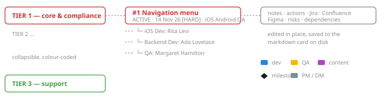

# Delivery ASAP hub

A local, dependency-free control center for a delivery manager: a markdown
knowledge vault on disk, rendered as an interactive Gantt chart with per
project notes, actions, links and an editable card schema.

Nothing leaves your machine, nothing is installed: it is Python 3.11+ standard
library and two static assets.



## Quick start

```bash
python3 dashboard.py --vault sample-vault --port 8099
```

Open <http://localhost:8099>. That runs against `sample-vault/`, a fictional
organisation used both as a demo and as the test fixture.

To use your own vault, point the settings at it and just run:

```bash
python3 dashboard.py
```

| Flag | Meaning |
|---|---|
| `--settings PATH` | settings file (default `settings.local.toml`, else `settings.toml`) |
| `--vault PATH` | vault root, keeping the folder layout from the settings |
| `--projects PATH` | directory of project cards (overrides `--vault`) |
| `--plan PATH` | delivery plan markdown file |
| `--host`, `--port` | bind address and port (default `127.0.0.1:8080`) |

The write API has no authentication, so the server binds to loopback. Pass
`--host 0.0.0.0` only on a network you trust.

## Configuration

Everything an organisation changes lives in [`settings.toml`](settings.toml):
tiers and their colours, squads and the people in them, roles, project codes,
Jira/Confluence/Figma base URLs, wording, vault paths. Adding a tier, a team
member or a project never requires touching Python.

Copy it to `settings.local.toml` (git-ignored) to keep your real names out of
the repository.

## The vault

```
<vault>/
├── 02-projects/active/<project-id>.md    one card per project
└── 03-delivery-patterns/delivery-plan.md a mermaid gantt block
```

A card is markdown with YAML front matter. Everything in
[`dahub/schema.py`](dahub/schema.py) is editable from the UI; unknown keys are
preserved untouched, so you can keep your own fields in a card.

```yaml
---
id: project-1-navigation-menu
name: Navigation menu — second level
tier: tier-1              # inline comments are fine
status: active            # active | blocked | inactive
priority: 1
intro: |-
  Block scalars are fine too, and survive a save.
dates:
  target_delivery: 2026-11-14
  deadline_text: 2026-11-14
  deadline_type: hard
tech_footprint:
  platforms: [iOS, Android, QA]
---
```

The delivery plan is a plain mermaid `gantt` block. A task label carrying a
short project code (`P1`, `P2`, ... as declared under `[project_codes]`) is
attached to that project; anything else becomes a stand-alone row in the last
tier. A label starting with a name from `[[squads]]` shows that person and
their role colour.

```
section iOS
iOS Dev #1 P1 menu integration  :crit, active, 2026-09-14, 25d
QA #2 time off                  :done, 2026-09-21, 5d
```

## Architecture

Layers, each with one reason to change; dependencies point inward and only
`repository` touches the filesystem.

| Module | Responsibility |
|---|---|
| `settings` | `settings.toml` parsing, fails fast; presentation constants |
| `frontmatter` | YAML front matter ⇄ Python data |
| `repository` | the vault on disk, atomic writes |
| `domain` | dates, tiers, roles, gantt parsing, timeline (pure, clock injected) |
| `schema` | the card schema, declared once |
| `markup` / `gantt` / `view` | HTML rendering |
| `api` | mutations, behind a routing table |
| `server` | HTTP, static assets, JSON |

Two rules worth keeping:

- **Data never reaches the browser inside executable code.** Values travel as
  escaped text or escaped `data-*` attributes; `static/app.js` is a real file
  that Python never generates.
- **Layout metrics live in one place.** `settings.py` emits them as CSS custom
  properties; the stylesheet and the resize script read them, they never
  restate them.

## Tests

```bash
python3 -m unittest test_dahub -v
```

53 tests, standard library only. The sample vault is the fixture: it contains
a blocked project, a malformed card, a project with no timeline task, notes
with quotes and newlines, deliberately awkward names and past/future tasks.

## License

MIT — see [LICENSE](LICENSE).
