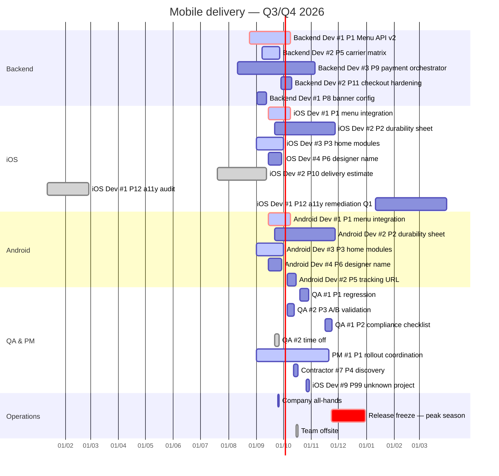

# Delivery plan — Q3/Q4 2026

Timeline source of truth for the dashboard. Each task line is
`<label> :<modifiers>, <start>, <duration|end>`; the label carries the short
project code (`P1`, `P2`, ...) declared in `settings.toml` under
`[project_codes]`. A task with no known code lands in the last tier
("operational") as a stand-alone row.

Modifiers: `crit` (critical path), `active` (in progress), `done` (used here
for time off, rendered in the time-off colour).

## How to read it

- **crit** marks the critical path, **active** work in progress.
- Rows whose label prefix matches a member in `[[squads]]` show that person's
  name and role colour; anything else falls back to keyword matching.
